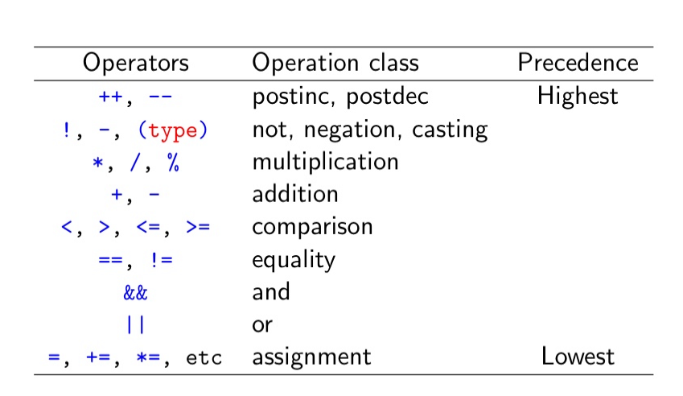

# Hello!!

This is a demo post to test out/showcase some features.

Read my entry about how this was made ([coming soon....](../)) to learn more about this blog.

# Feature Overview


1. **Markdown formatting** 
> Files are render through Astro with a custom Base.

2. **Code syntax highlighting**

3. **Latex-like math rendering** with katex

4. **Tag-based organization** 
>  see [tags](../../tags/) or click one of the tags on the top of this post.

# Markdown features
## Table of Contents

- [Math Demo](#math-demo)
	- [Inline math equations](#inline-math-equations)
	- [Another math demo](#another-math-demo)
	- [Block equations](#block-equations)
- [Markdown Table](#markdown-table)
- [Code Demo](#code-demo)
- [Callout Demo](#callout-demo)
- [Image Demo:](#image-demo)

Table of Contents auto generated in obsidian.
## Math Demo

### Inline math equations 
random integral, $\int_0^\infty e^{-x} dx = 1$

### Another math demo
A sequence $x_{1}, x_{2}, x_{3}\dots$ of real numbers is cauchy if 
$$
\begin{align*}
\forall \epsilon>0,
\exists N \in \mathbb{N} : \forall n,m &\ge N \Rightarrow |x_{n} - x_{m}| < \epsilon
\end{align*}
$$

### Block equations

$$
\hat{f}(\xi) = \int_{-\infty}^{\infty} f(x) e^{-2\pi i x \xi} dx
$$

## Markdown Table

with custom css

| Table | Col 1 | Col 2 |
| ----- | ----- | ----- |
| Row 1 | T11   | T12   |
| Row 2 | T21   | T22   |

## Code Demo

Binary Search in C:

```c
int first_true(int* arr, int n, int (*is_true)(int)){
	if(!n) return n;
	
	int lo=0, hi = n-1;
	while(lo<hi){
		int mid = lo + (hi-low)/2;
		
		if(is_true(arr[mid])){
			// go to left subarr
			// inclusive of mid
			// new subarr = [lo, mid]
			hi = mid;
		}
		else{
			// right subarr
			// skip mid
			// new subarr = (mid, hi]
			lo = mid+1;	
		}
	}
	// if lo==hi we have hit the candidate
	return is_true(arr[lo]) ? lo : n;
}
```

## Callout Demo

> [!Note] Here is a callout
> Obsidian style callout support with https://github.com/r4ai/remark-callout

> [!Warning] Different type of callout (Warning Callout)
> Nested Exaple
>  > [!Quote] Nested Level 1 (Quote Callout)
>  >  Nested Level 1 content
> > > [!Example] Nested Level 2 (Example Callout)
>  >  Nested Level 2 content
> > >
> >  > Nested Level 2 Line 2  
>  > 
>  > Level 1 again  


## Image Demo:
A screenshot of a lecture slide:


*custom css for image captions*

See [more stuff....](../../posts/)