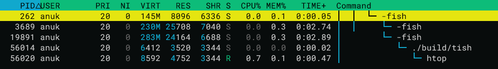

## Table of Contents

- [fork and execve usage within a shell program](#fork-and-execve-usage-within-a-shell-program)
	- [What is fork()](#what-is-fork)
	- [What is execve()](#what-is-execve)
	- [Using fork() and execv() to run a new process](#using-fork-and-execv-to-run-a-new-process)
	- [Usage within my shell program](#usage-within-my-shell-program)
- [System calls](#system-calls)
- [Hello World in Assembly](#hello-world-in-assembly)
	- [Calling a syscall in x86_64 Linux Assembly](#calling-a-syscall-in-x86_64-linux-assembly)
	- [hello_world.s](#hello_worlds)
- [Resources](#resources)
	- [Computer Systems: A Programmers Perspective (CSAPP)](#computer-systems-a-programmers-perspective-csapp)
	- [writing a shell, fork(), execv()](#writing-a-shell-fork-execv)
	- [syscalls](#syscalls)
	- [Basic Assembly/C](#basic-assemblyc)

 While writing a [toy shell](https://github.com/anukindipa/TiSH) program in C++ I encountered system calls `fork()` and `execve()`. Till this point my understanding of syscalls had been fairly basic and I had not written any code with them. This led me to explore system calls in more detail and document my learnings in this blog post.
## fork and execve usage within a shell program

A fundamental operation in Shell programs is **running programs specified by the user**. A shell must be able to **create a new process** in which the requested process runs, while ensuring the **shell continues to exist**. In 'Unix-like' operating systems this is done by creating child processes with `fork()` and replacing the child process with the requested process with `execve()`.

### What is fork()

`fork()` is system call used in UNIX-like systems that **duplicates the calling process** and creates a almost identical child process with a different PID. The child process gets a identical but separate copy of the parents user-level virtual address space. This includes the user stack, heap, code and data segments. 

In C the value returned by `fork()` differs in the parent and child  
- fork returns the Process ID (PID) of the child process created.
- within the child the value returned by fork is 0.
This difference allows the parent and child to follow separate execution paths after calling fork as detailed later.
### What is execve()

`execve()` is another system call in UNIX-like operating systems that runs a specified program by **replacing the current process**. The new process keeps its old PID but, the code, data, heap and stack of the previous process is replaced.

### Using fork() and execv() to run a new process

The standard method of creating a new process without terminating the parent process is by first duplicating a process using `fork()` and running `execv()` within the child process. 

Since the child process inherits the parents user-level address space, both the child and parent processes continues execution from the instruction right after `fork()`.  

Hence, the return value of `fork()` can be used to follow two different execution paths.
- The child detects a return value of `0` and uses `execv` to replace itself with the new program.
- The parent process receives the child's PID and waits for the process with that PID to terminate. `waitpid()` is used for this purpose in my code below.

> [!Info] Running syscalls from C/C++ 
> `unistd.h` (Unix Standard header) is a C/C++ header file that provides access to the POSIX operating system API.  The functions `fork()`,  `execv()`, `exit()`, `write()` defined within `unistd.h` act as wrappers for the OS system calls.

### Usage within my shell program

 The C++ code below demonstrates how these ideas are implemented in my shell ([commands.cpp](https://github.com/anukindipa/TiSH/blob/main/src/commands.cpp)).

```c++
void exec_cmd(const char* cmd_path, char* const args[]) {
	pid_t pid = fork();
	if (pid == 0) {
		/*       child process       */
		// args is taken from by tokenizing user input
		execv(cmd_path, args);
		
		// execv should not return
		// because the child process is completely replaced.
		std::cerr << "Error executing command" << std::endl;
		exit(1);
	
	} else if (pid > 0) {
		/*     parent process     */
		// status stores exit info of the child process
		int status;
		
		// wait for child to run
		waitpid(pid, &status, 0);
	} else {
		// negative returns mean fork failed
		std::cerr << "Error forking process" << std::endl;
	}
	
}
```

Running `pstree` or using a process viewer exposes the child parent relationship between my shell (tish) and its child process.

```shell
> pstree -p 19891
fish(19891)───tish(56014)───pstree(56015)
```


*process tree in [htop](https://htop.dev/)*

## System calls

Having explored a use of some syscalls it is now a good time to step back and explore what system calls are in more detail and why `fork()` and `execve()` are implemented this way.

Modern Operating Systems separate memory into **user space** and **kernel space**. User space refers to all code running outside the OS kernel. Processes in user space run within their own virtual memory space and cannot access memory outside their address space. So, operations such as memory management, I/O, and process management is **restricted to the OS kernel**.

Because of this intentional restriction, user processes are unable to read/write to files, create a new process, access shared memory or even exit without explicitly **requesting these actions from the kernel**. Giving user processes the ability to preform those actions directly would risk corrupting the global state, and compromising security and stability. 

The interface which allows user space programs to request privileged operations from the kernel is known as a **system call**.  Whenever a syscall is invoked, execution transfers to kernel mode, the requested privileged service is performed by the OS kernel, and control is returned back to the user program.

Operations such as `fork()` and `execve()`  must be implemented as syscalls as they alter process state and virtual memory layout.  If a program were allowed to manage processes directly, conflicting memory layouts could arise and potentially crash the entire operating system.

## Hello World in Assembly

In Unix-like systems, [everything is treated as a file](https://unix.stackexchange.com/questions/141016/a-laymans-explanation-for-everything-is-a-file-what-differs-from-windows), including `stdout`. As such, even writing text to the terminal requires I/O operations and must invoke a syscall. So even 'trivial' functions in C such as `printf()` invoke the `write` system call at some point to  request the kernel to perform the actual output.

Program termination also depends on a syscall such as `exit`. A user space program cannot exit on its own as the kernel is in charge of process management. Hence, even the simplest programs depends on system calls.

So just using `write` and `exit` system calls it is possible to write a simple hello world program.

### Calling a syscall in x86_64 Linux Assembly

While it is possible to access C standard library functions within assembly, it would be much more interesting to invoke syscalls manually.

To make a syscall in x86_64 Linux assembly, registers must have the following values:
- `rax` - syscall number
- `rdi`, `rsi`, `rdx`, `r10`, `r8`, `r9` - arguments in order.

The syscall number for any syscall is stored in a system call table. Each system call has a unique integer ID. 

For the case of `write` it's syscall number is 1, and `write` requires 
- `int fd` - stores file descriptor (1 for standard output).
- `const void *buf` - pointer to the buffer containing data to be written.
- `size_t count` - number of bytes to be written.

The `exit` syscall (number 60) is much simpler and only requires the return exit status code as a argument. 

### hello_world.s

Implementing the ideas above in GNU assembler syntax (used by the CSAPP textbook) leads to the code below:

```asm
# data section declares static data
.section .data
# store 'hello, world!\n' in a variable called string
string:
    .ascii "hello, world!\n"
# calculate number of bytes in the string
string_end:
    .equ len, string_end - string
    
# text section contains instructions
.section .text

# make _start visible to the linker
.globl _start

# entry point
_start:
	# write(1, string, len)
    movq $1, %rax         # system call 1 is write
	movq $1, %rdi         # file handle 1 is stdout
    movq $string, %rsi    # pass address of 'hello, world!'
    movq $len, %rdx       # number of bytes
    syscall               # request a syscall

	# exit(0)
    movq $60, %rax        # syscall 60 is exit
    movq $0, %rdi         # return exit code 0
    syscall               # request syscall again
 
```

Using gcc we are able to produce an executable that prints "hello, world!" just with syscalls.

```
> gcc -nostdlib -no-pie -o hello_world_s hello_world.s
> ./hello_world_s
hello, world!
```


## Resources

Further readings and what i used as references for this post:

### Computer Systems: A Programmers Perspective (CSAPP)

I used this as my primary reference book
- https://csapp.cs.cmu.edu/
- chapter 8 has a lot of details on syscalls including details on fork, execv and running hello world in assembly.
- In fact, the lab exercise in chapter 8 is creating a unix-like shell.

### writing a shell, fork(), execv()

- General Guides to writing a shell
	- https://www.cs.purdue.edu/homes/grr/SystemsProgrammingBook/Book/Chapter5-WritingYourOwnShell.pdf
	- https://brennan.io/2015/01/16/write-a-shell-in-c/

- Execv and fork in Linux man pages
	- https://man7.org/linux/man-pages/man3/exec.3.html
	- https://man7.org/linux/man-pages/man2/fork.2.html

- A great video on how Linux creates processes by 'Core Dumped'
	- https://www.youtube.com/watch?v=SwIPOf2YAgI

### syscalls

- Syscalls are OS specific and is a key reason for why application are OS specific. This video by 'Core Dumped' explores this further with a good explanation of syscalls.
	- https://www.youtube.com/watch?v=eP_P4KOjwhs
- StackOverflow Post on why syscalls exist
	- https://stackoverflow.com/questions/50626460/why-do-system-calls-exist
- Yet another 'Core Dumped' video on how kernel mode and user mode works and what happens when syscalls are invoked.
	- https://www.youtube.com/watch?v=H4SDPLiUnv4
### Basic Assembly/C

- YouTube video about a writing hello world in C with no libraries (Ends up writing assembly within a C file).
	- https://www.youtube.com/watch?v=gVaXLlGqQ-c
- How to call syscalls in assembly
	- https://stackoverflow.com/questions/20326025/linux-assembly-how-to-call-syscall
- calling c functions from assembly
	- https://github.com/0xAX/asm/blob/master/content/asm_7.md
- Intro to x86_64 assembly in linux
	- https://github.com/0xAX/asm
- I used `-nostdlib` flag in gcc to avoid linking startup libraries. More details: 
	- https://stackoverflow.com/questions/2548486/compiling-without-libc